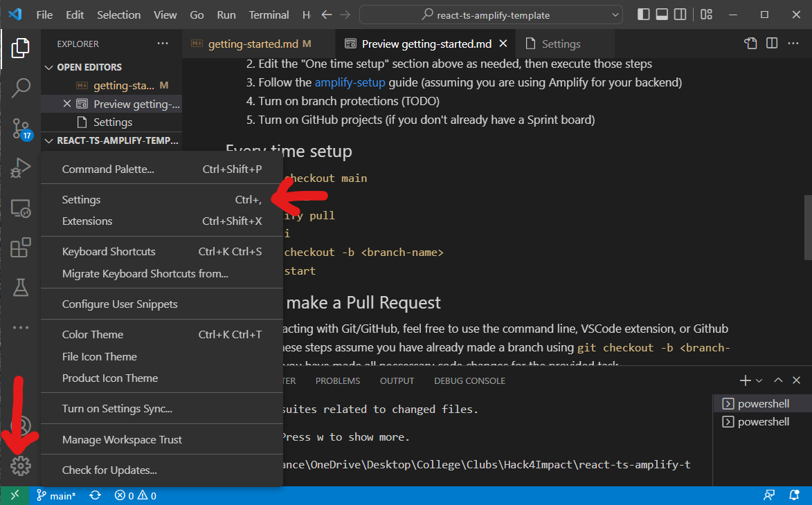
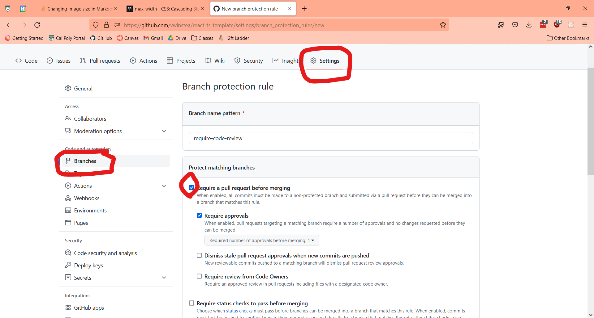

# Getting Started

Welcome to the getting started page! Here is all you need to know to get this repo up and running on your local machine, as well as good collaborative coding practices

## Contents

- [Setup for All Developers](#setup-for-all-developers)
- [Setup for Tech Leads](#setup-for-tech-leads)
- [Helpful commands](#helpful-commands)
- [Project Structure](#project-structure)
- [Design](#design)
- [Key Features](#key-features)
- [API endpoints](#api-endpoints)
- [Services Used](#services-used)

## Setup for all Developers

1. Clone this repository `git clone <repo-url>`
2. Run `npm i` at the root of the repository
3. Create a .env file and retrieve secrets from your tech lead
4. Install IDE Extensions
   - [Prettier](https://marketplace.visualstudio.com/items?itemName=esbenp.prettier-vscode)
   - [ESLint](https://marketplace.visualstudio.com/items?itemName=dbaeumer.vscode-eslint)
5. Enable format on save in your IDE
   1. Click the settings button in the bottom left  
      
   2. Search "formatter" and set your default formatter to Prettier
   3. Search "format on save" and click the checkbox
6. Familiarize yourself with [Helpful Commands](#helpful-commands), the [Project Structure](#project-structure), and the [steps for contributing](./contributing.md).

## Setup for Tech Leads

1. Set up a MongoDB cluster and create a .env with the URI
2. Edit the "One time setup" section above as needed, then execute those steps
3. Turn on branch protections for main and develop branches
   1. Visit your repo on [github.com](https://github.com)
   2. Click the Settings button on the top bar
   3. Click the branches tab on the left sidebar
   4. Click add rule
   5. Click "Require a pull request before merging"
   6. Create  
      
4. See [template-features.md](./template-features.md) for features included in this template repository.

## Helpful commands

- `npm run dev`: Start your local development environment at [http://localhost:3000](http://localhost:3000)
- `npm run lint`: make sure Prettier and ESLint pass
- `npm run lint:fix`: make sure Prettier and ESLint pass and try to automatically fix all issues (some ESLint issues must be resolved manually)
- `git stash`: Temporarily remove all local changes to a branch and save them. Good when you need to hop to another branch without committing your current code.
- `git stash apply`: Reapply most recent git stash.
- `git merge orgin/master`: Pull all changes from the main branch to yours, good for resolving merge conflicts.

## Project Structure

- [**.github**](/.github) Github Actions CI/CD and Issue/PR templates
- [**docs**](/docs) Documentation, including getting-started + contributing info.
- [**public**](/public) Assets for frontend [Read More](https://nextjs.org/docs/pages/building-your-application/optimizing/static-assets)
- [**src**](/src) All application code
  - [**app**](/src/app/) Frontend and API code
    - [**api**](/src/app/api) All API routes
    - [**admin**](/src/admin) Admin portal; all admin related pages
    - [**components**](/src/app/components) All reusable components
    - [**images**](/src/app/images) Site-wide images (admin and home pages)
    - [**/\***](/src/app/) App router routes for various pages
    - [**styles**](/src/app/styles) All CSS files
  - [**database**](/src/database) MongoDB schemas and related files
  - [**helpers**](/src/helpers) Mongoose connection
  - [**services**](/src/services) Cookies + Sessions

This is a [Next.js](https://nextjs.org/) project bootstrapped with [`create-next-app`](https://github.com/vercel/next.js/tree/canary/packages/create-next-app).

## Design
[**Link to Figma**](https://www.figma.com/design/akcfaXKNzKZgjCgt8g60AL/Login-%26-Sign-up-2.0?node-id=0-1&t=wC2mq9RlKJjh6jUY-0)

## Key Features
**Admin**
- Create/Update/Delete New event for registered users to sign up for. (/src/app/admin/manage-events)
- Create/Update Blogs to appear in blog page. (/src/app/admin/blog)
- Create new resource to appear in resources page. (/src/app/admin/resources)
- Manage members; view/edit an organized list of users, including contact information. (/src/app/admin/members)
- Send emails by user type (volunteers, members, partners/donors, or individual). (/src/app/admin/email)
- View donation history. (/src/app/admin/donations)
- View event history, including signees + relevant information. (/src/app/admin/eventHistory)

**User Authentication**
- Create account (/src/app/createAccount)
- Login to account (/src/app/login)
- Forgot password (/src/app//forgotPassword)
- Reset password (/src/app/resetPassword)

**Navigation & Other Features**
- Learn Go See's Story (src/app//about)
- Donate to Go See Foundation (/src/app/donate)
- View blog page, including search button (/src/app/blog)
- View resources and supporters of Go See Foundation (/src/app/resources)
- Sign up for an upcoming event (/src/app/eventSignup)

## API Endpoints

- /aws: Uploading files to Amazon S3 and storing the file URLs in a database
- /blog: Create and Fetch Blogs.
- /blog/[blogID]: Delete Blogs.
- /donations: Fetching Donations.
- /events: Exclusive admin priviledge; Create new event, Fetch events.
- /events[eventName]: Exclusive admin priviledge; Fetch individual event, Delete Events.
- /eventSignUp: Creates a new event signee in database with signup details.
- /eventSignUp/[eventName]: Fetching individual event.
- /forgot-password: Conditional depending on database info (ie, checks whether email exists).
- /login: Authenticates user by verifying their email and password. If the credentials are correct, it generates a JSON Web Token (JWT) for the session, sets an HTTP-only cookie with the JWT, and responds with a success message.
- /registration: Allows new users to register by providing their details. It validates the input, hashes the password for security, and stores the user information in the database. If any required fields are missing or if an error occurs, it returns an appropriate error message.
- /resources: Creating new resource, fetching all resources.
- /stripe: Handling stripe-related donation.
- /user/[userID]: Exclusive admin priviledge; fetching and deleting an individual user.
- /user: Exclusive admin priviledge; fetching all users (including fetching by user type).

## Services Used

- **Next.js**: We used Next.js to lessen the overhead of deploying a separate back-end. It provided tooling that would otherwise have been installed seperately (built-in routing, serverless functions, middleware, etc.)
- **MongoDB**: MongoDB offers high performance, low-latency performance, and real-time analysis. It supports a flexible data model that can handle a variety of data formats, including structured and unstructured data. 
- **AWS Services**: S3 for image storage.

## Learn More about Next.js

To learn more about Next.js, take a look at the following resources:

- [Next.js Documentation](https://nextjs.org/docs) - learn about Next.js features and API.
- [Learn Next.js](https://nextjs.org/learn) - an interactive Next.js tutorial.
- [NextAuth Documentation](https://next-auth.js.org/) - learn about authentication and authorization with NextAuth

You can check out [the Next.js GitHub repository](https://github.com/vercel/next.js/) - your feedback and contributions are welcome!
